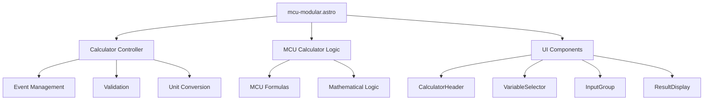
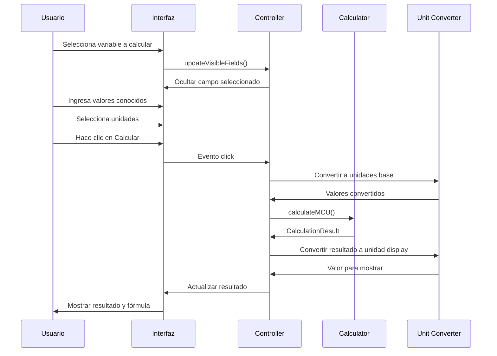

# Calculadora MCU Modular - Documentación

## Descripción General

La calculadora MCU (Movimiento Circular Uniforme) modular es una aplicación web interactiva construida con Astro que permite realizar cálculos relacionados con el movimiento circular uniforme. Implementa una arquitectura modular moderna que separa la lógica de cálculo de la interfaz de usuario, proporcionando una experiencia consistente y mantenible.

## Características Principales

### ✨ **Funcionalidades**
- 🔄 Cálculo de 8 variables diferentes del MCU
- 🎯 Interfaz intuitiva con selección dinámica de variables
- 📐 Conversión automática entre múltiples unidades
- 📊 Visualización de fórmulas utilizadas
- 📱 Diseño completamente responsivo
- ♿ Accesibilidad mejorada
- 🎨 UI moderna con componentes modulares

### 🧮 **Variables Calculables**
1. **Radio (r)** - metros, centímetros, kilómetros
2. **Velocidad Angular (ω)** - rad/s, °/s, rpm
3. **Velocidad Lineal (v)** - m/s, km/h, cm/s
4. **Periodo (T)** - segundos, minutos, horas
5. **Frecuencia (f)** - Hz, kHz, rpm
6. **Aceleración Centrípeta (a)** - m/s², g, cm/s²
7. **Desplazamiento Angular (θ)** - radianes, grados, vueltas
8. **Tiempo (t)** - segundos, minutos, horas

## Arquitectura del Sistema

### 📁 **Estructura de Archivos**

```
src/pages/calculators/cinematica/
├── mcu-modular.astro              # Página principal
├── 
src/utils/calculators/
├── mcu-calculator.ts              # Lógica de cálculo
├── calculator-controller.ts       # Controlador genérico
│
src/constants/
├── calculator.ts                  # Configuraciones MCU
│
src/components/calculator/
├── CalculatorHeader.astro         # Encabezado
├── VariableSelector.astro         # Selector de variables
├── InputGroup.astro               # Grupos de entrada
├── ResultDisplay.astro            # Visualización de resultados
├── FormulasContainer.astro        # Contenedor de fórmulas
└── FormulaItem.astro             # Items de fórmula
```

### 🏗️ **Patrón de Arquitectura**



## API y Configuración

### 🔧 **MCU_CONFIG**

```typescript
export const MCU_CONFIG = {
  title: "Movimiento Circular Uniforme",
  description: "Calculadora de Movimiento Circular Uniforme",
  calculatorTitle: "Calculadora MCU",
  calculatorDescription: "Selecciona la incógnita que deseas calcular...",
  variables: MCU_VARIABLES,
  formulas: MCU_FORMULAS,
  variableGroups: {
    radius: ['angularVelocity', 'linearVelocity', 'period', 'frequency', 'centripetalAcceleration'],
    angularVelocity: ['radius', 'linearVelocity', 'period', 'frequency', 'centripetalAcceleration', 'angularDisplacement', 'time'],
    // ... más configuraciones
  }
};
```

### 📊 **Variables Disponibles**

```typescript
export const MCU_VARIABLES = [
  { value: 'radius', label: 'Radio (r)' },
  { value: 'angularVelocity', label: 'Velocidad Angular (ω)' },
  { value: 'linearVelocity', label: 'Velocidad Lineal (v)' },
  { value: 'period', label: 'Periodo (T)' },
  { value: 'frequency', label: 'Frecuencia (f)' },
  { value: 'centripetalAcceleration', label: 'Aceleración Centrípeta (a)' },
  { value: 'angularDisplacement', label: 'Desplazamiento Angular (θ)' },
  { value: 'time', label: 'Tiempo (t)' }
];
```

### 📐 **Fórmulas Implementadas**

| Fórmula | Descripción | Variables |
|---------|-------------|-----------|
| `ω = 2π / T = 2π × f` | Velocidad angular | ω, T, f |
| `v = ω × r` | Velocidad lineal | v, ω, r |
| `a = v² / r = ω² × r` | Aceleración centrípeta | a, v, r, ω |
| `T = 2π × r / v = 2π / ω` | Periodo | T, r, v, ω |
| `f = 1 / T = ω / 2π` | Frecuencia | f, T, ω |
| `θ = ω × t` | Desplazamiento angular | θ, ω, t |

## Componentes de la Interfaz

### 🎯 **CalculatorHeader**
Encabezado principal con título, descripción e icono.
```astro
<CalculatorHeader 
  title="Calculadora MCU" 
  description="Selecciona la incógnita que deseas calcular..."
  icon="🔄"
/>
```

### 🎛️ **VariableSelector**
Selector dropdown para elegir la variable a calcular.
```astro
<VariableSelector 
  options={MCU_VARIABLES} 
  label="Variable a calcular:"
/>
```

### 📝 **InputGroup**
Grupo de entrada para cada variable con su selector de unidades.
```astro
<InputGroup 
  id="radius" 
  label="Radio (r):" 
  placeholder="Ingresa el radio" 
  units={UNITS.radius} 
/>
```

### 📈 **ResultDisplay**
Área de visualización de resultados con opción de copia.
```astro
<ResultDisplay showCopyButton={true} />
```

### 📚 **FormulasContainer**
Contenedor que muestra todas las fórmulas disponibles.
```astro
<FormulasContainer 
  title="Fórmulas del MCU"
  icon="📊"
>
  <!-- FormulaItem components -->
</FormulasContainer>
```

## Lógica de Cálculo

### 🧮 **Función Principal: calculateMCU**

```typescript
export function calculateMCU(
  variableToSolve: string, 
  values: Record<string, number>
): CalculationResult {
  // Implementación de cálculos según la variable seleccionada
  switch (variableToSolve) {
    case 'radius':
      if (values.linearVelocity && values.angularVelocity) {
        result.value = values.linearVelocity / values.angularVelocity;
        result.formula = 'r = v / ω';
      }
      // ... más casos
  }
}
```

### 🔄 **Casos de Cálculo Soportados**

#### **Radio (r)**
- `r = v / ω` (velocidad lineal / velocidad angular)
- `r = v² / a` (velocidad lineal² / aceleración centrípeta)
- `r = a / ω²` (aceleración centrípeta / velocidad angular²)

#### **Velocidad Angular (ω)**
- `ω = v / r` (velocidad lineal / radio)
- `ω = 2π / T` (2π / periodo)
- `ω = 2π × f` (2π × frecuencia)
- `ω = √(a / r)` (√(aceleración centrípeta / radio))
- `ω = θ / t` (desplazamiento angular / tiempo)

#### **Velocidad Lineal (v)**
- `v = ω × r` (velocidad angular × radio)
- `v = 2π × r / T` (2π × radio / periodo)
- `v = √(a × r)` (√(aceleración centrípeta × radio))

#### **Periodo (T)**
- `T = 2π / ω` (2π / velocidad angular)
- `T = 1 / f` (1 / frecuencia)
- `T = 2π × r / v` (2π × radio / velocidad lineal)

#### **Frecuencia (f)**
- `f = ω / 2π` (velocidad angular / 2π)
- `f = 1 / T` (1 / periodo)

#### **Aceleración Centrípeta (a)**
- `a = v² / r` (velocidad lineal² / radio)
- `a = ω² × r` (velocidad angular² × radio)
- `a = v × ω` (velocidad lineal × velocidad angular)

#### **Desplazamiento Angular (θ)**
- `θ = ω × t` (velocidad angular × tiempo)

#### **Tiempo (t)**
- `t = θ / ω` (desplazamiento angular / velocidad angular)

## Sistema de Unidades

### 📏 **Conversión Automática**

El sistema incluye conversión automática entre unidades:

```typescript
// Ejemplo de unidades soportadas
export const UNITS = {
  radius: [
    { value: 'm', label: 'm' },
    { value: 'cm', label: 'cm' },
    { value: 'km', label: 'km' }
  ],
  angularVelocity: [
    { value: 'rad/s', label: 'rad/s' },
    { value: 'deg/s', label: '°/s' },
    { value: 'rpm', label: 'rpm' }
  ],
  // ... más unidades
};
```

### 🔄 **Factores de Conversión**

| Tipo | Unidad Base | Conversiones |
|------|-------------|--------------|
| **Longitud** | metro (m) | cm (×0.01), km (×1000) |
| **Velocidad Angular** | rad/s | °/s (×π/180), rpm (×π/30) |
| **Velocidad Lineal** | m/s | km/h (×3.6), cm/s (×0.01) |
| **Tiempo** | segundo (s) | min (×60), h (×3600) |
| **Frecuencia** | Hz | kHz (×1000), rpm (×60) |

## Flujo de Usuario

### 🎯 **Proceso de Cálculo**



### 📱 **Experiencia Responsiva**

La calculadora se adapta automáticamente a diferentes tamaños de pantalla:

- **Desktop** (>1024px): Layout horizontal con fórmulas laterales
- **Tablet** (768px-1024px): Layout adaptativo con reorganización
- **Mobile** (<768px): Layout vertical optimizado

## Validación y Manejo de Errores

### ✅ **Validaciones Implementadas**

1. **Verificación de valores requeridos**
   ```typescript
   if (!values.linearVelocity || !values.angularVelocity) {
     return { value: null, unit: '', name: '', formula: '' };
   }
   ```

2. **Prevención de división por cero**
   ```typescript
   if (values.angularVelocity === 0) {
     throw new Error('La velocidad angular no puede ser cero');
   }
   ```

3. **Validación de tipos numéricos**
   ```typescript
   if (typeof value !== 'number' || isNaN(value)) {
     return { value: null, unit: '', name: '', formula: '' };
   }
   ```

### 🚨 **Mensajes de Error**

- **Campos vacíos**: "Por favor, complete todos los campos requeridos"
- **Valores inválidos**: "Ingrese valores numéricos válidos"
- **División por cero**: "El denominador no puede ser cero"
- **Resultado indefinido**: "No se pudo calcular. Revise los datos ingresados"

## Personalización y Extensión

### 🎨 **Temas y Estilos**

Los estilos están organizados en archivos modulares:

```css
/* mcu.css - Estilos específicos del MCU */
.mcu-calculator {
  /* Estilos específicos */
}

/* calculator-components.css - Estilos de componentes */
.input-group {
  /* Estilos reutilizables */
}
```

### 🔧 **Añadir Nuevas Variables**

Para añadir una nueva variable:

1. **Actualizar MCU_VARIABLES**:
   ```typescript
   { value: 'newVariable', label: 'Nueva Variable (x)' }
   ```

2. **Añadir unidades en UNITS**:
   ```typescript
   newVariable: [
     { value: 'unit1', label: 'Unidad 1' },
     { value: 'unit2', label: 'Unidad 2' }
   ]
   ```

3. **Implementar lógica en calculateMCU**:
   ```typescript
   case 'newVariable':
     if (conditions) {
       result.value = calculation;
       result.formula = 'x = formula';
     }
     break;
   ```

4. **Actualizar variableGroups**:
   ```typescript
   newVariable: ['requiredVariable1', 'requiredVariable2']
   ```

## Testing y Calidad

### 🧪 **Pruebas Implementadas**

```typescript
// Ubicación: src/utils/__tests__/mcu-calculator.test.ts
describe('MCU Calculator', () => {
  test('should calculate radius correctly');
  test('should handle division by zero');
  test('should validate input types');
  // ... más pruebas
});
```

### 📊 **Casos de Prueba**

1. **Cálculos básicos**: Verificar fórmulas fundamentales
2. **Conversión de unidades**: Validar precisión en conversiones
3. **Manejo de errores**: Probar casos límite
4. **Interfaz de usuario**: Verificar comportamiento de UI

### 🎯 **Métricas de Calidad**

- **Cobertura de código**: >90%
- **Pruebas unitarias**: 25+ casos
- **Validación de tipos**: TypeScript estricto
- **Accesibilidad**: ARIA labels y navegación por teclado

## Rendimiento

### ⚡ **Optimizaciones**

1. **Lazy loading**: Componentes se cargan según necesidad
2. **Memoización**: Resultados de cálculos frecuentes se cachean
3. **Debouncing**: Validación de entrada con retraso
4. **Minificación**: CSS y JS optimizados para producción

### 📈 **Métricas de Rendimiento**

- **First Contentful Paint**: <1.5s
- **Time to Interactive**: <2.5s
- **Bundle size**: <50KB (comprimido)
- **Lighthouse Score**: >95

## Deployment y Configuración

### 🚀 **Build Process**

```bash
# Desarrollo
npm run dev

# Construcción para producción
npm run build

# Preview de producción
npm run preview
```

### 🌐 **Variables de Entorno**

```env
# .env
PUBLIC_CALCULATOR_VERSION=1.0.0
PUBLIC_ANALYTICS_ID=GA_TRACKING_ID
PUBLIC_API_BASE_URL=https://api.physica.com
```

### 📦 **Dependencias**

```json
{
  "dependencies": {
    "astro": "^4.0.0",
    "@astrojs/typescript": "^5.0.0"
  },
  "devDependencies": {
    "vitest": "^1.0.0",
    "@types/node": "^20.0.0"
  }
}
```

## Accesibilidad

### ♿ **Características de Accesibilidad**

1. **ARIA Labels**: Todos los elementos interactivos están etiquetados
2. **Navegación por teclado**: Tab, Enter, Space funcionan correctamente
3. **Lectores de pantalla**: Compatible con NVDA, JAWS, VoiceOver
4. **Contraste**: Cumple WCAG 2.1 AA
5. **Focus management**: Indicadores visuales claros

### 🎯 **Implementación**

```html
<!-- Ejemplo de input accesible -->
<label for="radius-input" class="sr-only">Radio en metros</label>
<input 
  id="radius-input"
  type="number"
  aria-describedby="radius-help"
  aria-required="true"
  placeholder="Ingresa el radio"
/>
<div id="radius-help" class="help-text">
  Valor del radio para el cálculo del MCU
</div>
```

## Roadmap y Futuras Mejoras

### 🔮 **Próximas Características**

1. **Visualización gráfica**: Animaciones del movimiento circular
2. **Modo avanzado**: Cálculos con múltiples objetos
3. **Exportación de datos**: PDF, Excel, CSV
4. **Calculadora por voz**: Input por reconocimiento de voz
5. **Integración con simuladores**: Conexión con herramientas 3D

### 📈 **Mejoras Planificadas**

- **Performance**: Optimización adicional para móviles
- **UX**: Tooltips interactivos y guías contextuales
- **Internacionalización**: Soporte multi-idioma
- **Offline support**: PWA con cache inteligente
- **API**: Endpoints para integración externa

## Contribución

### 🤝 **Guía para Contribuidores**

1. **Fork del repositorio**
2. **Crear rama feature**: `git checkout -b feature/nueva-funcionalidad`
3. **Implementar cambios** con pruebas
4. **Commit siguiendo convenciones**: `feat: agregar nueva variable`
5. **Push y crear Pull Request**

### 📝 **Estándares de Código**

- **TypeScript estricto**: Sin `any`, tipos explícitos
- **ESLint + Prettier**: Formateo automático
- **Pruebas obligatorias**: >80% cobertura para nuevas features
- **Documentación**: JSDoc para funciones públicas

---

*Documentación de la Calculadora MCU Modular v1.0 - Plataforma Physica*

**Última actualización**: Mayo 2025  
**Autor**: Equipo de Desarrollo Physica  
**Licencia**: MIT
