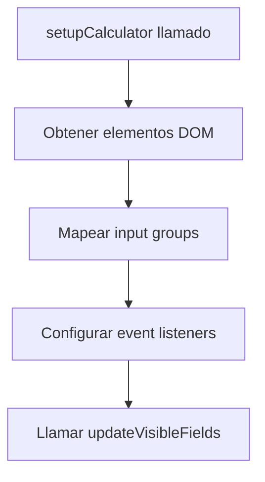
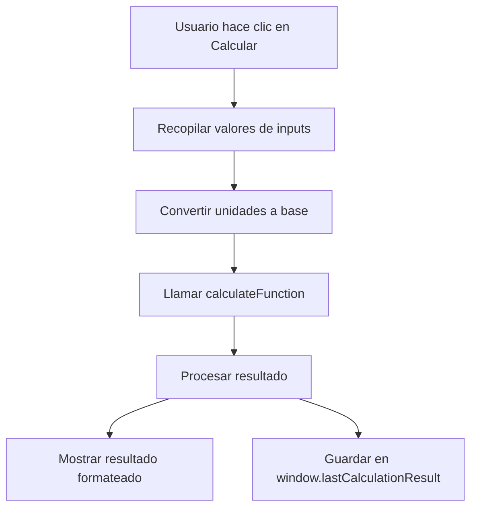

# Calculator Controller Documentation

## Descripción General

El `calculator-controller.ts` es un controlador genérico que proporciona una infraestructura reutilizable para implementar calculadoras científicas en la plataforma Physica. Este módulo abstrae la lógica común de las calculadoras, permitiendo que diferentes tipos de calculadoras (MCU, MCUA, Segunda Ley de Newton, etc.) compartan la misma base de funcionalidad.

## Arquitectura

### Propósito Principal
- **Abstracción**: Separa la lógica de interfaz de usuario de los cálculos específicos
- **Reutilización**: Permite que múltiples calculadoras usen la misma infraestructura
- **Consistencia**: Garantiza una experiencia de usuario uniforme
- **Mantenibilidad**: Centraliza la gestión de eventos y validaciones

### Componentes Principales

```typescript
export interface CalculatorConfig {
  calculateFunction: (variableToSolve: string, values: Record<string, number>) => CalculationResult;
  variableGroups: Record<string, string[]>;
}
```

## API Reference

### Funciones Principales

#### `getElementByIdStrict<T>(id: string): T`

Función utilitaria que obtiene un elemento DOM por su ID con verificación estricta de existencia.

**Parámetros:**
- `id: string` - El ID del elemento a obtener
- `T extends HTMLElement` - El tipo específico de elemento HTML esperado

**Retorna:**
- `T` - El elemento HTML del tipo especificado

**Throws:**
- `Error` - Si no se encuentra un elemento con el ID especificado

**Ejemplo:**
```typescript
const inputElement = getElementByIdStrict<HTMLInputElement>("velocity-input");
const selectElement = getElementByIdStrict<HTMLSelectElement>("variable-to-solve");
```

#### `setupCalculator(config: CalculatorConfig): void`

Función principal que inicializa y configura una calculadora genérica.

**Parámetros:**
- `config: CalculatorConfig` - Configuración específica de la calculadora

**Configuración requerida:**
```typescript
interface CalculatorConfig {
  calculateFunction: (variableToSolve: string, values: Record<string, number>) => CalculationResult;
  variableGroups: Record<string, string[]>;
}
```

## Estructura del DOM Esperada

### Elementos Requeridos

La calculadora espera que el HTML contenga los siguientes elementos con IDs específicos:

```html
<!-- Selector de variable a resolver -->
<select id="variable-to-solve">
  <option value="variable1">Variable 1</option>
  <!-- ... más opciones -->
</select>

<!-- Botón de cálculo -->
<button id="calculate-btn">Calcular</button>

<!-- Contenedores de resultado -->
<div id="result"></div>
<div id="formula-used"></div>

<!-- Grupos de entrada para cada variable -->
<div class="input-group" id="variable1-group">
  <input id="variable1" type="number">
  <select id="variable1-unit">
    <option value="m">metros</option>
    <!-- ... más unidades -->
  </select>
</div>
```

### Convenciones de Naming

1. **Grupos de entrada**: `{variable}-group`
2. **Inputs**: `{variable}`
3. **Selectores de unidad**: `{variable}-unit`
4. **Conversión a camelCase**: Los IDs con guiones se convierten automáticamente

Ejemplo:
```
"net-force" → "netForce"
"initial-velocity" → "initialVelocity"
```

## Flujo de Funcionamiento

### 1. Inicialización



### 2. Gestión de Visibilidad

El controlador maneja automáticamente qué campos mostrar basándose en:
- La variable seleccionada para resolver (se oculta)
- Los grupos de variables configurados en `variableGroups`

```typescript
// Ejemplo de configuración de grupos
const variableGroups = {
  "netForce": ["mass", "acceleration"],
  "mass": ["netForce", "acceleration"],
  "acceleration": ["netForce", "mass"]
};
```

### 3. Proceso de Cálculo



## Integración con Calculadoras Específicas

### Ejemplo: Segunda Ley de Newton

```typescript
// En segunda-ley-newton.astro
import { setupCalculator } from "../../../utils/calculators/calculator-controller";
import { calculateNewton } from "../../../utils/calculators/dinamica/segunda-ley/segunda-ley-calculator";
import { NEWTON_SECOND_LAW_CONFIG } from "../../../constants/calculator";

document.addEventListener('DOMContentLoaded', function() {
  setupCalculator({
    calculateFunction: calculateNewton,
    variableGroups: NEWTON_SECOND_LAW_CONFIG.variableGroups
  });
});
```

### Configuración en Constants

```typescript
// En constants/calculator.ts
export const NEWTON_SECOND_LAW_CONFIG = {
  variableGroups: {
    "netForce": ["mass", "acceleration"],
    "mass": ["netForce", "acceleration"], 
    "acceleration": ["netForce", "mass"]
  }
};
```

## Características Avanzadas

### 1. Conversión de Unidades

El controlador integra automáticamente el sistema de conversión de unidades:

```typescript
// Convierte a unidad base antes del cálculo
const baseValue = convertToBaseUnit(inputValue, variableType, selectedUnit);

// Convierte desde unidad base para mostrar resultado
const displayValue = convertFromBaseUnit(result.value, variableType, displayUnit);
```

### 2. Almacenamiento de Resultados

Cada cálculo se guarda en `window.lastCalculationResult` para análisis posterior:

```typescript
(window as any).lastCalculationResult = result;
```

### 3. Validación Robusta

- Verifica existencia de elementos DOM
- Maneja valores NaN e infinitos
- Valida entrada de datos antes del cálculo
- Proporciona mensajes de error descriptivos

### 4. Gestión de Estado

- Actualiza visibilidad de campos dinámicamente
- Mantiene estado de unidades seleccionadas
- Preserva valores entre cambios de variable

## Manejo de Errores

### Errores Comunes y Soluciones

1. **Elemento no encontrado**
   ```
   Error: Element with id variable-to-solve not found
   ```
   - Verificar que el HTML contenga todos los elementos requeridos

2. **Función de cálculo incompatible**
   ```
   TypeError: Cannot read property 'value' of undefined
   ```
   - Asegurar que `calculateFunction` retorne objeto con propiedades correctas

3. **Grupos de variables mal configurados**
   - Verificar que los nombres en `variableGroups` coincidan con los IDs en HTML

## Buenas Prácticas

### Para Desarrolladores

1. **Usar TypeScript estricto**: Aprovechar los tipos para evitar errores
2. **Validar configuración**: Verificar `variableGroups` antes de usar
3. **Manejar casos edge**: Considerar valores NaN, infinitos, etc.
4. **Documentar variables**: Usar nombres descriptivos y consistentes

### Para Integraciones

1. **Seguir convenciones de naming**: Usar patrones consistentes para IDs
2. **Configurar grupos correctamente**: Definir relaciones entre variables
3. **Implementar función de cálculo compatible**: Retornar `CalculationResult`
4. **Incluir todos los elementos DOM**: No omitir elementos requeridos

## Testing

### Pruebas Unitarias Disponibles

```typescript
// Ubicación: src/utils/__tests__/calculator-controller.test.ts
describe('Calculator Controller', () => {
  test('should setup calculator correctly');
  test('should handle variable selection');
  test('should convert units properly');
  // ... más pruebas
});
```

### Casos de Prueba Recomendados

1. **Inicialización correcta**
2. **Cambio de variable a resolver**
3. **Cálculos con diferentes unidades**
4. **Manejo de errores de entrada**
5. **Persistencia de resultados**

## Compatibilidad

### Navegadores Soportados
- Chrome 90+
- Firefox 88+
- Safari 14+
- Edge 90+

### Dependencias
- Sistema de conversión de unidades (`unit-converter`)
- Tipos TypeScript (`types/index.ts`)
- Configuraciones de calculadora (`constants/calculator.ts`)

## Changelog

### Versión Actual
- ✅ Soporte para múltiples tipos de calculadoras
- ✅ Conversión automática de unidades
- ✅ Gestión dinámica de visibilidad
- ✅ Almacenamiento de resultados
- ✅ Validación robusta de entrada

### Próximas Mejoras
- 🔄 Sistema de plugins para calculadoras
- 🔄 Validación de esquemas de configuración
- 🔄 Soporte para cálculos asíncronos
- 🔄 Historial de cálculos

## Contribución

Para contribuir al desarrollo del controlador:

1. Seguir las convenciones de TypeScript
2. Añadir pruebas para nueva funcionalidad
3. Documentar cambios en la API
4. Mantener compatibilidad hacia atrás
5. Actualizar esta documentación

---

*Esta documentación corresponde al Calculator Controller v1.0 de la Plataforma Physica.*
