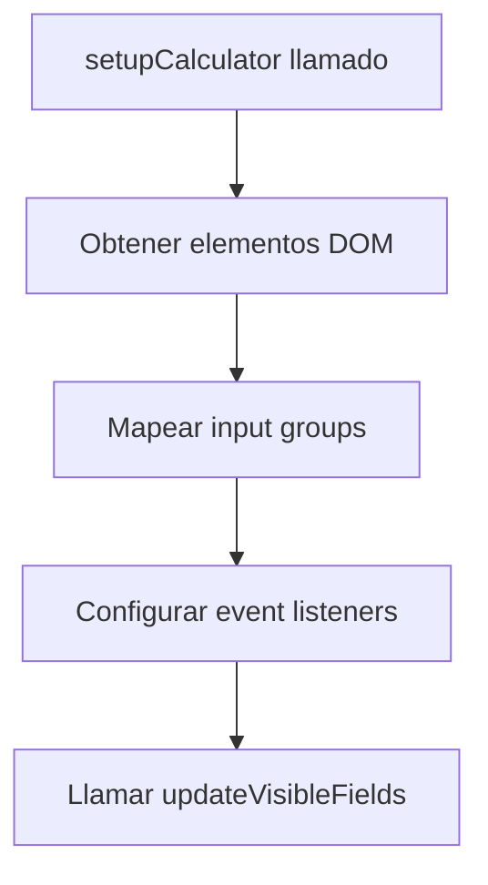
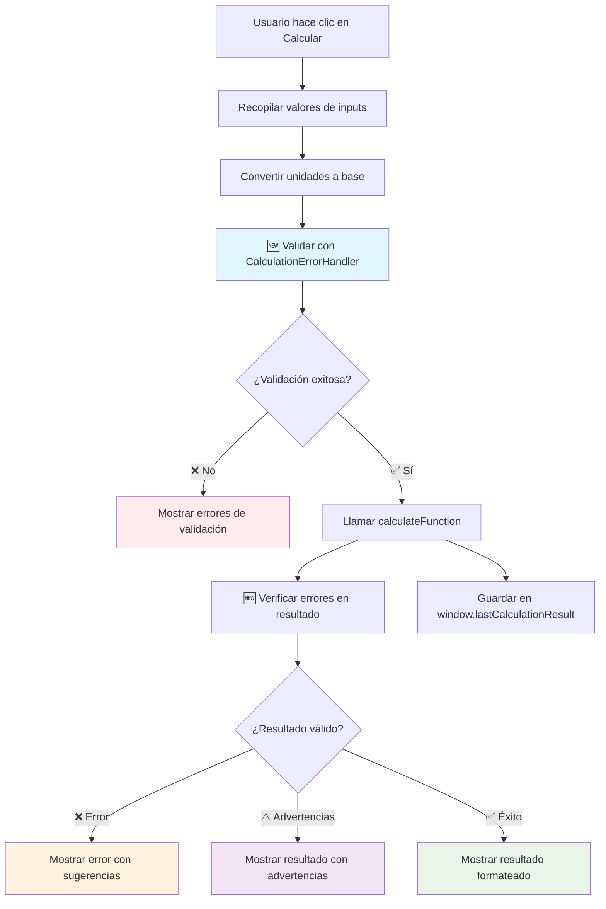

# Calculator Co### Propósito Principal
- **Abstracción**: Separa la lógica de interfaz de usuario de los cálculos específicos
- **Reutilización**: Permite que múltiples calculadoras usen la misma infraestructura
- **Consistencia**: Garantiza una experiencia de usuario uniforme
- **Mantenibilidad**: Centraliza la gestión de eventos y validaciones
- **🆕 Robustez**: Sistema integral de manejo de errores y validación de datos
- **🆕 Accesibilidad**: Mensajes de error claros y sugerencias constructivas

### Componentes Principales

```typescript
export interface CalculatorConfig {
  calculateFunction: (variableToSolve: string, values: Record<string, number>) => CalculationResult;
  variableGroups: Record<string, string[]>;
}
```

### 🆕 Integración con CalculationErrorHandler

El controlador ahora integra un sistema robusto de manejo de errores que incluye:

```typescript
// Validación automática de entradas
const validation = CalculationErrorHandler.validateInputs(
  variableToSolve, 
  values, 
  requiredFields, 
  fieldLabels
);

// Manejo de errores de cálculo
const calcError = CalculationErrorHandler.handleCalculationError(error, variableToSolve);
```mentation

## Descripción General

El `calculator-controller.ts` es un controlador genérico que proporciona una infraestructura reutilizable para implementar calculadoras científicas en la plataforma Physica. Este módulo abstrae la lógica común de las calculadoras, permitiendo que diferentes tipos de calculadoras (MCU, MCUA, Segunda Ley de Newton, etc.) compartan la misma base de funcionalidad.

### Características Destacadas (v2.0)
- **🛡️ Manejo Robusto de Errores**: Integración completa con `CalculationErrorHandler` para validación exhaustiva
- **✅ Validación de Entrada**: Verificación automática de campos requeridos, valores NaN e infinitos
- **🎯 Mensajes de Error Contextuales**: Errores descriptivos con sugerencias específicas para el usuario
- **📊 Soporte para Advertencias**: Capacidad de mostrar advertencias junto con resultados válidos
- **🔧 Detalles Técnicos**: Información detallada para debugging y análisis avanzado

## Arquitectura

### Propósito Principal
- **Abstracción**: Separa la lógica de interfaz de usuario de los cálculos específicos
- **Reutilización**: Permite que múltiples calculadoras usen la misma infraestructura
- **Consistencia**: Garantiza una experiencia de usuario uniforme
- **Mantenibilidad**: Centraliza la gestión de eventos y validaciones

### Componentes Principales

```typescript
export interface CalculatorConfig {
  calculateFunction: (variableToSolve: string, values: Record<string, number>) => CalculationResult;
  variableGroups: Record<string, string[]>;
}
```

## API Reference

### Funciones Principales

#### `getElementByIdStrict<T>(id: string): T`

Función utilitaria que obtiene un elemento DOM por su ID con verificación estricta de existencia.

**Parámetros:**
- `id: string` - El ID del elemento a obtener
- `T extends HTMLElement` - El tipo específico de elemento HTML esperado

**Retorna:**
- `T` - El elemento HTML del tipo especificado

**Throws:**
- `Error` - Si no se encuentra un elemento con el ID especificado

**Ejemplo:**
```typescript
const inputElement = getElementByIdStrict<HTMLInputElement>("velocity-input");
const selectElement = getElementByIdStrict<HTMLSelectElement>("variable-to-solve");
```

#### `setupCalculator(config: CalculatorConfig): void`

Función principal que inicializa y configura una calculadora genérica.

**Parámetros:**
- `config: CalculatorConfig` - Configuración específica de la calculadora

**Configuración requerida:**
```typescript
interface CalculatorConfig {
  calculateFunction: (variableToSolve: string, values: Record<string, number>) => CalculationResult;
  variableGroups: Record<string, string[]>;
}
```

## Estructura del DOM Esperada

### Elementos Requeridos

La calculadora espera que el HTML contenga los siguientes elementos con IDs específicos:

```html
<!-- Selector de variable a resolver -->
<select id="variable-to-solve">
  <option value="variable1">Variable 1</option>
  <!-- ... más opciones -->
</select>

<!-- Botón de cálculo -->
<button id="calculate-btn">Calcular</button>

<!-- Contenedores de resultado -->
<div id="result"></div>
<div id="formula-used"></div>

<!-- Grupos de entrada para cada variable -->
<div class="input-group" id="variable1-group">
  <input id="variable1" type="number">
  <select id="variable1-unit">
    <option value="m">metros</option>
    <!-- ... más unidades -->
  </select>
</div>
```

### Convenciones de Naming

1. **Grupos de entrada**: `{variable}-group`
2. **Inputs**: `{variable}`
3. **Selectores de unidad**: `{variable}-unit`
4. **Conversión a camelCase**: Los IDs con guiones se convierten automáticamente

Ejemplo:
```
"net-force" → "netForce"
"initial-velocity" → "initialVelocity"
```

## Flujo de Funcionamiento

### 1. Inicialización



### 2. Gestión de Visibilidad

El controlador maneja automáticamente qué campos mostrar basándose en:
- La variable seleccionada para resolver (se oculta)
- Los grupos de variables configurados en `variableGroups`

```typescript
// Ejemplo de configuración de grupos
const variableGroups = {
  "netForce": ["mass", "acceleration"],
  "mass": ["netForce", "acceleration"],
  "acceleration": ["netForce", "mass"]
};
```

### 🆕 3. Proceso de Cálculo con Validación Robusta



### 🆕 4. Sistema de Validación de Entrada

```typescript
// Mapeo automático de etiquetas para campos
const fieldLabels: Record<string, string> = {};
Object.keys(inputs).forEach(key => {
  const label = inputs[key].closest('.input-group')?.querySelector('label')?.textContent || key;
  fieldLabels[key] = label;
});

// Validación exhaustiva
const validation = CalculationErrorHandler.validateInputs(
  variableToSolve, 
  values, 
  requiredFields, 
  fieldLabels
);
```

## Integración con Calculadoras Específicas

### Ejemplo: Segunda Ley de Newton

```typescript
// En segunda-ley-newton.astro
import { setupCalculator } from "../../../utils/calculators/calculator-controller";
import { calculateNewton } from "../../../utils/calculators/dinamica/segunda-ley/segunda-ley-calculator";
import { NEWTON_SECOND_LAW_CONFIG } from "../../../constants/calculator";

document.addEventListener('DOMContentLoaded', function() {
  setupCalculator({
    calculateFunction: calculateNewton,
    variableGroups: NEWTON_SECOND_LAW_CONFIG.variableGroups
  });
});
```

### Configuración en Constants

```typescript
// En constants/calculator.ts
export const NEWTON_SECOND_LAW_CONFIG = {
  variableGroups: {
    "netForce": ["mass", "acceleration"],
    "mass": ["netForce", "acceleration"], 
    "acceleration": ["netForce", "mass"]
  }
};
```

## Características Avanzadas

### 1. Conversión de Unidades

El controlador integra automáticamente el sistema de conversión de unidades:

```typescript
// Convierte a unidad base antes del cálculo
const baseValue = convertToBaseUnit(inputValue, variableType, selectedUnit);

// Convierte desde unidad base para mostrar resultado
const displayValue = convertFromBaseUnit(result.value, variableType, displayUnit);
```

### 🆕 2. Sistema Integral de Validación y Manejo de Errores

#### Validación de Entradas
```typescript
// Validación automática antes del cálculo
const validation = CalculationErrorHandler.validateInputs(
  variableToSolve, 
  values, 
  requiredFields, 
  fieldLabels
);

if (!validation.isValid && validation.error) {
  // Mostrar error detallado con sugerencias
  resultDiv.innerHTML = `
    <div class="error-container">
      <div class="error-icon">❌</div>
      <div class="error-content">
        <h4>Error en los datos de entrada</h4>
        <p>${validation.error.userMessage}</p>
        <div class="suggestions">
          <ul>
            ${validation.error.suggestions.map(suggestion => `<li>${suggestion}</li>`).join('')}
          </ul>
        </div>
      </div>
    </div>
  `;
}
```

#### Manejo de Errores de Cálculo
```typescript
try {
  const result = config.calculateFunction(variableToSolve, validation.processedValues!);
  
  // Verificar errores en el resultado
  if (result.error) {
    // Mostrar error específico del cálculo
    // Incluye detalles técnicos y sugerencias contextuales
  }
} catch (error) {
  // Manejo de errores inesperados
  const calcError = CalculationErrorHandler.handleCalculationError(error, variableToSolve);
  // Mostrar error con información técnica para debugging
}
```

#### Soporte para Advertencias
```typescript
// Los resultados pueden incluir advertencias sin ser errores
if (result.warnings) {
  // Mostrar advertencias junto con el resultado válido
  resultDiv.innerHTML += `
    <div class="warnings">
      ${result.warnings.map(warning => `<div class="warning">⚠️ ${warning}</div>`).join('')}
    </div>
  `;
}
```

### 3. Almacenamiento de Resultados

Cada cálculo se guarda en `window.lastCalculationResult` para análisis posterior:

```typescript
(window as any).lastCalculationResult = result;
```

### 🆕 4. Mapeo Automático de Etiquetas

El sistema automáticamente extrae las etiquetas de los campos para mensajes de error más descriptivos:

```typescript
const fieldLabels: Record<string, string> = {};
Object.keys(inputs).forEach(key => {
  const label = inputs[key].closest('.input-group')?.querySelector('label')?.textContent || key;
  fieldLabels[key] = label;
});
```

### 5. Gestión de Estado Avanzada

- Actualiza visibilidad de campos dinámicamente
- Mantiene estado de unidades seleccionadas
- Preserva valores entre cambios de variable
- 🆕 Valida coherencia de datos automáticamente
- 🆕 Proporciona feedback inmediato sobre errores

## Manejo de Errores

### 🆕 Sistema Robusto de Manejo de Errores

El controlador ahora incluye un sistema integral de manejo de errores que proporciona:

#### Tipos de Errores Soportados

1. **Errores de Validación de Entrada**
   - Campos faltantes o vacíos
   - Valores NaN o infinitos
   - Datos fuera de rangos válidos

2. **Errores de Cálculo**
   - Divisiones por cero
   - Operaciones matemáticas inválidas
   - Resultados físicamente imposibles

3. **Errores Inesperados**
   - Excepciones no controladas
   - Problemas de configuración
   - Fallos del sistema

#### Estructura de Mensajes de Error

```typescript
interface CalculationError {
  type: string;
  message: string;              // Mensaje técnico
  userMessage: string;          // Mensaje amigable para el usuario
  suggestions: string[];        // Sugerencias constructivas
  technicalDetails?: string;    // Información técnica detallada
  missingFields?: string[];     // Campos faltantes específicos
  invalidFields?: string[];     // Campos con valores inválidos
}
```

#### Ejemplos de Manejo de Errores

```typescript
// Error de validación - campos faltantes
{
  type: 'missing_values',
  userMessage: 'Faltan valores requeridos para realizar el cálculo',
  suggestions: [
    'Completa todos los campos marcados como requeridos',
    'Verifica que hayas ingresado valores numéricos válidos',
    'Asegúrate de no dejar campos en blanco'
  ],
  missingFields: ['Masa', 'Aceleración']
}

// Error de cálculo - división por cero
{
  type: 'division_by_zero',
  userMessage: 'No es posible dividir por cero en este cálculo',
  suggestions: [
    'Verifica que el denominador no sea cero',
    'Revisa los valores ingresados',
    'Considera usar un valor muy pequeño en lugar de cero'
  ],
  technicalDetails: 'Division by zero in force calculation: F = ma where a = 0'
}
```

### Errores Comunes y Soluciones

1. **❌ Elemento no encontrado**
   ```
   Error: Element with id variable-to-solve not found
   ```
   - **Causa**: HTML incompleto o IDs incorrectos
   - **Solución**: Verificar que el HTML contenga todos los elementos requeridos

2. **❌ Valores de entrada inválidos**
   ```
   Error en los datos de entrada: Valores inválidos detectados
   ```
   - **Causa**: Campos contienen NaN, infinito o están vacíos
   - **Solución**: Completar todos los campos con valores numéricos válidos

3. **❌ Función de cálculo incompatible**
   ```
   TypeError: Cannot read property 'value' of undefined
   ```
   - **Causa**: `calculateFunction` no retorna estructura correcta
   - **Solución**: Asegurar que retorne objeto `CalculationResult` válido

4. **⚠️ Resultado con advertencias**
   - **Causa**: Cálculo válido pero con condiciones especiales
   - **Solución**: Revisar advertencias y confirmar si el resultado es apropiado

### 🆕 Características de Debugging

#### Información Técnica Expandible
```html
<details class="technical-details">
  <summary>Detalles técnicos</summary>
  <p>Division by zero: denominator = 0 in equation F = ma</p>
</details>
```

#### Logging para Desarrollo
```typescript
// Automático en errores inesperados
console.error('Calculation error:', error);

// Acceso al último resultado para análisis
console.log(window.lastCalculationResult);
```

## 🆕 Interfaz de Usuario Mejorada

### Estilos CSS para Manejo de Errores

El sistema ahora incluye clases CSS específicas para diferentes tipos de mensajes:

```css
/* Contenedor principal de errores */
.error-container {
  border: 1px solid #f44336;
  border-radius: 8px;
  padding: 16px;
  background-color: #ffebee;
  margin: 16px 0;
}

/* Contenedor de éxito */
.success-container {
  border: 1px solid #4caf50;
  border-radius: 8px;
  padding: 16px;
  background-color: #e8f5e8;
}

/* Advertencias */
.warnings {
  margin-top: 12px;
  padding: 8px;
  background-color: #fff3e0;
  border-left: 4px solid #ff9800;
}

.warning {
  margin: 4px 0;
  color: #f57c00;
}

/* Iconos de estado */
.error-icon {
  font-size: 24px;
  margin-bottom: 8px;
}

/* Detalles técnicos expandibles */
.technical-details {
  margin-top: 12px;
  padding: 8px;
  background-color: #f5f5f5;
  border-radius: 4px;
}

.technical-details summary {
  cursor: pointer;
  font-weight: bold;
  color: #666;
}

/* Listas de sugerencias */
.suggestions ul {
  margin: 8px 0;
  padding-left: 20px;
}

.suggestions li {
  margin: 4px 0;
  color: #555;
}

/* Campos específicos */
.missing-fields, .invalid-fields {
  margin: 8px 0;
  padding: 8px;
  background-color: #fff8e1;
  border-radius: 4px;
}
```

### Tipos de Mensajes Visuales

#### 1. ✅ Resultado Exitoso
```html
<div class="success-container">
  <div class="result-main">
    Fuerza Neta = <strong>15.0000 N</strong>
  </div>
</div>
```

#### 2. ⚠️ Resultado con Advertencias
```html
<div class="success-container">
  <div class="result-main">
    Velocidad = <strong>299792458.0000 m/s</strong>
  </div>
  <div class="warnings">
    <div class="warning">⚠️ Esta velocidad se acerca a la velocidad de la luz</div>
  </div>
</div>
```

#### 3. ❌ Error de Validación
```html
<div class="error-container">
  <div class="error-icon">❌</div>
  <div class="error-content">
    <h4>Error en los datos de entrada</h4>
    <p>Faltan valores requeridos para realizar el cálculo</p>
    <div class="missing-fields">
      <strong>Campos requeridos:</strong> Masa, Aceleración
    </div>
    <div class="suggestions">
      <strong>Sugerencias:</strong>
      <ul>
        <li>Completa todos los campos marcados como requeridos</li>
        <li>Verifica que hayas ingresado valores numéricos válidos</li>
      </ul>
    </div>
  </div>
</div>
```

#### 4. 💥 Error Inesperado
```html
<div class="error-container">
  <div class="error-icon">💥</div>
  <div class="error-content">
    <h4>Error inesperado</h4>
    <p>Ocurrió un error durante el cálculo</p>
    <details class="technical-details">
      <summary>Información técnica</summary>
      <p>TypeError: Cannot read property 'value' of undefined</p>
    </details>
  </div>
</div>
```

## 🆕 Integración con CalculationErrorHandler

### Importación y Uso

```typescript
import { CalculationErrorHandler } from '../Handlers/calculator-error-handler';

// Validación de entradas
const validation = CalculationErrorHandler.validateInputs(
  variableToSolve, 
  values, 
  requiredFields, 
  fieldLabels
);

// Manejo de errores de cálculo
try {
  const result = config.calculateFunction(variableToSolve, validation.processedValues!);
} catch (error) {
  const calcError = CalculationErrorHandler.handleCalculationError(error, variableToSolve);
  // Mostrar error procesado
}
```

### Tipos de Validación Soportados

#### 1. Validación de Campos Requeridos
```typescript
// Detecta campos faltantes automáticamente
const missingFields = requiredFields.filter(field => 
  !(field in values) || values[field] === undefined || values[field] === null
);
```

#### 2. Validación de Valores Numéricos
```typescript
// Detecta valores NaN e infinitos
const invalidFields: string[] = [];
for (const [key, value] of Object.entries(values)) {
  if (isNaN(value) || !isFinite(value)) {
    invalidFields.push(key);
  }
}
```

#### 3. Validación Contextual
El `CalculationErrorHandler` puede implementar validaciones específicas según el tipo de cálculo:

```typescript
// Ejemplo: validación para Segunda Ley de Newton
static validateNewtonInputs(values: Record<string, number>): ValidationResult {
  // Validar que la masa sea positiva
  if (values.mass && values.mass <= 0) {
    return {
      isValid: false,
      error: {
        type: 'invalid_physics',
        userMessage: 'La masa debe ser un valor positivo',
        suggestions: ['Ingresa un valor mayor que cero para la masa']
      }
    };
  }
  // ... más validaciones específicas
}
```

### Estructura de Respuesta de Validación

```typescript
interface ValidationResult {
  isValid: boolean;
  processedValues?: Record<string, number>;
  error?: CalculationError;
}

interface CalculationError {
  type: string;
  message: string;
  userMessage: string;
  suggestions: string[];
  technicalDetails?: string;
  missingFields?: string[];
  invalidFields?: string[];
}
```

### Para Desarrolladores

1. **Usar TypeScript estricto**: Aprovechar los tipos para evitar errores
2. **Validar configuración**: Verificar `variableGroups` antes de usar
3. **Manejar casos edge**: Considerar valores NaN, infinitos, etc.
4. **Documentar variables**: Usar nombres descriptivos y consistentes

### Para Integraciones

1. **Seguir convenciones de naming**: Usar patrones consistentes para IDs
2. **Configurar grupos correctamente**: Definir relaciones entre variables
3. **Implementar función de cálculo compatible**: Retornar `CalculationResult`
4. **Incluir todos los elementos DOM**: No omitir elementos requeridos

## Buenas Prácticas

### Para Desarrolladores

1. **🆕 Implementar CalculationError en funciones de cálculo**
   ```typescript
   function calculateNewton(variableToSolve: string, values: Record<string, number>): CalculationResult {
     try {
       // Validaciones específicas del cálculo
       if (values.mass === 0) {
         return {
           value: null,
           unit: 'N',
           name: 'Fuerza',
           formula: 'F = ma',
           error: {
             type: 'division_by_zero',
             message: 'Mass cannot be zero',
             userMessage: 'La masa no puede ser cero en la Segunda Ley de Newton',
             suggestions: [
               'Ingresa un valor positivo para la masa',
               'Verifica que no hayas dejado el campo vacío'
             ],
             technicalDetails: 'Division by zero: F = ma where m = 0'
           }
         };
       }
       
       // Cálculo normal
       const result = values.mass * values.acceleration;
       
       // Advertencias opcionales
       const warnings: string[] = [];
       if (result > 10000) {
         warnings.push('Esta es una fuerza muy grande, verifica los valores');
       }
       
       return {
         value: result,
         unit: 'N',
         name: 'Fuerza Neta',
         formula: 'F = ma',
         warnings: warnings.length > 0 ? warnings : undefined
       };
     } catch (error) {
       return {
         value: null,
         unit: 'N',
         name: 'Fuerza',
         formula: 'F = ma',
         error: {
           type: 'calculation_error',
           message: error.message,
           userMessage: 'Error durante el cálculo de la fuerza',
           suggestions: ['Verifica los valores ingresados', 'Contacta soporte si el problema persiste']
         }
       };
     }
   }
   ```

2. **Usar TypeScript estricto**: Aprovechar los tipos para evitar errores
3. **🆕 Manejar todos los casos edge**: Incluir validaciones para valores límite
4. **🆕 Proporcionar mensajes descriptivos**: Usar `fieldLabels` para mejores mensajes
5. **Documentar variables**: Usar nombres descriptivos y consistentes

### Para Integraciones

1. **Seguir convenciones de naming**: Usar patrones consistentes para IDs
2. **🆕 Configurar etiquetas descriptivas**: Usar `<label>` elementos para mejores mensajes de error
3. **Configurar grupos correctamente**: Definir relaciones entre variables
4. **🆕 Implementar función de cálculo robusta**: Incluir manejo de errores y advertencias
5. **Incluir todos los elementos DOM**: No omitir elementos requeridos

### 🆕 Ejemplo de Integración Completa

```typescript
// calculadora-ejemplo.astro
---
import { setupCalculator } from "../../../utils/calculators/calculator-controller";
import CalculatorLayout from "../../../layouts/CalculatorLayout.astro";
---

<CalculatorLayout title="Calculadora de Ejemplo">
  <div class="calculator-container">
    <!-- Selector de variable -->
    <div class="input-group">
      <label for="variable-to-solve">Variable a calcular:</label>
      <select id="variable-to-solve">
        <option value="force">Fuerza (F)</option>
        <option value="mass">Masa (m)</option>
        <option value="acceleration">Aceleración (a)</option>
      </select>
    </div>

    <!-- Campos de entrada con etiquetas descriptivas -->
    <div class="input-group" id="force-group">
      <label for="force">Fuerza:</label>
      <input type="number" id="force" step="any">
      <select id="force-unit">
        <option value="N">Newtons (N)</option>
        <option value="kN">Kilonewtons (kN)</option>
      </select>
    </div>

    <div class="input-group" id="mass-group">
      <label for="mass">Masa:</label>
      <input type="number" id="mass" step="any">
      <select id="mass-unit">
        <option value="kg">Kilogramos (kg)</option>
        <option value="g">Gramos (g)</option>
      </select>
    </div>

    <div class="input-group" id="acceleration-group">
      <label for="acceleration">Aceleración:</label>
      <input type="number" id="acceleration" step="any">
      <select id="acceleration-unit">
        <option value="m/s2">m/s² (m/s²)</option>
        <option value="cm/s2">cm/s² (cm/s²)</option>
      </select>
    </div>

    <!-- Botón y resultados -->
    <button id="calculate-btn">Calcular</button>
    <div id="result"></div>
    <div id="formula-used"></div>
  </div>
</CalculatorLayout>

<script>
  import { setupCalculator } from "../../../utils/calculators/calculator-controller";
  import { calculateNewton } from "../../../utils/calculators/newton-calculator";
  
  document.addEventListener('DOMContentLoaded', function() {
    setupCalculator({
      calculateFunction: calculateNewton,
      variableGroups: {
        "force": ["mass", "acceleration"],
        "mass": ["force", "acceleration"],
        "acceleration": ["force", "mass"]
      }
    });
  });
</script>
</CalculatorLayout>
```

## Testing

### 🆕 Pruebas Unitarias Actualizadas

```typescript
// src/utils/__tests__/calculator-controller.test.ts
import { describe, test, expect, beforeEach } from 'vitest';
import { setupCalculator, getElementByIdStrict } from '../calculator-controller';
import { CalculationErrorHandler } from '../Handlers/calculator-error-handler';

describe('Calculator Controller v2.0', () => {
  beforeEach(() => {
    // Setup DOM elements for testing
    document.body.innerHTML = `
      <select id="variable-to-solve">
        <option value="force">Fuerza</option>
      </select>
      <button id="calculate-btn">Calcular</button>
      <div id="result"></div>
      <div id="formula-used"></div>
      <div class="input-group" id="mass-group">
        <label for="mass">Masa</label>
        <input id="mass" type="number">
        <select id="mass-unit">
          <option value="kg">kg</option>
        </select>
      </div>
    `;
  });

  test('should validate inputs correctly', () => {
    const validation = CalculationErrorHandler.validateInputs(
      'force',
      { mass: NaN, acceleration: 10 },
      ['mass', 'acceleration'],
      { mass: 'Masa', acceleration: 'Aceleración' }
    );
    
    expect(validation.isValid).toBe(false);
    expect(validation.error?.invalidFields).toContain('mass');
  });

  test('should handle calculation errors gracefully', () => {
    const error = new Error('Test error');
    const calcError = CalculationErrorHandler.handleCalculationError(error, 'force');
    
    expect(calcError.userMessage).toBeDefined();
    expect(calcError.suggestions).toBeDefined();
    expect(calcError.technicalDetails).toBeDefined();
  });

  test('should setup calculator with error handling', () => {
    const mockCalculateFunction = vi.fn().mockReturnValue({
      value: 100,
      unit: 'N',
      name: 'Fuerza',
      formula: 'F = ma'
    });

    expect(() => {
      setupCalculator({
        calculateFunction: mockCalculateFunction,
        variableGroups: {
          "force": ["mass", "acceleration"]
        }
      });
    }).not.toThrow();
  });

  test('should display warnings with valid results', () => {
    const resultWithWarnings = {
      value: 1000000,
      unit: 'N',
      name: 'Fuerza',
      formula: 'F = ma',
      warnings: ['Esta es una fuerza muy grande']
    };

    // Test que el resultado se muestre con advertencias
    expect(resultWithWarnings.warnings).toBeDefined();
    expect(resultWithWarnings.warnings!.length).toBeGreaterThan(0);
  });
});
```

### Casos de Prueba Recomendados

1. **✅ Inicialización correcta** con elementos DOM completos
2. **✅ Validación de entrada** con diferentes tipos de errores
3. **✅ Cambio de variable a resolver** y actualización de visibilidad
4. **✅ Cálculos con diferentes unidades** y conversiones
5. **🆕 Manejo de errores de validación** con campos faltantes/inválidos
6. **🆕 Manejo de errores de cálculo** con mensajes contextuales
7. **🆕 Mostrar advertencias** junto con resultados válidos
8. **🆕 Mapeo de etiquetas** para mensajes descriptivos
9. **✅ Persistencia de resultados** en `window.lastCalculationResult`
10. **🆕 Información técnica** para debugging

### 🆕 Pruebas de Integración

```typescript
describe('Calculator Integration Tests', () => {
  test('should handle complete user workflow', async () => {
    // 1. Setup calculator
    setupCalculator(config);
    
    // 2. User selects variable to solve
    const variableSelect = document.getElementById('variable-to-solve') as HTMLSelectElement;
    variableSelect.value = 'force';
    variableSelect.dispatchEvent(new Event('change'));
    
    // 3. User enters invalid data
    const massInput = document.getElementById('mass') as HTMLInputElement;
    massInput.value = 'invalid';
    
    // 4. User clicks calculate
    const calculateBtn = document.getElementById('calculate-btn') as HTMLButtonElement;
    calculateBtn.click();
    
    // 5. Verify error is displayed
    const resultDiv = document.getElementById('result') as HTMLDivElement;
    expect(resultDiv.innerHTML).toContain('error-container');
    expect(resultDiv.innerHTML).toContain('Valores inválidos');
  });
});
```

## Compatibilidad

### Navegadores Soportados
- Chrome 90+
- Firefox 88+
- Safari 14+
- Edge 90+

### Dependencias
- Sistema de conversión de unidades (`unit-converter`)
- 🆕 **CalculationErrorHandler** (`utils/Handlers/calculator-error-handler`)
- Tipos TypeScript (`types/index.ts`, `types/calculator-controller-type.ts`)
- Configuraciones de calculadora (`constants/calculator.ts`)

## Changelog

### 🆕 Versión 2.0 (Actual)
- ✅ **Integración completa con CalculationErrorHandler**
- ✅ **Validación robusta de entradas** con detección de campos faltantes e inválidos
- ✅ **Mensajes de error contextuales** con sugerencias específicas
- ✅ **Soporte para advertencias** en resultados válidos
- ✅ **Detalles técnicos expandibles** para debugging avanzado
- ✅ **Mapeo automático de etiquetas** para mensajes más descriptivos
- ✅ **Manejo de errores inesperados** con información técnica
- ✅ **Interfaz de usuario mejorada** con iconos y estilos para diferentes tipos de mensajes

### Versión 1.0 (Anterior)
- ✅ Soporte para múltiples tipos de calculadoras
- ✅ Conversión automática de unidades
- ✅ Gestión dinámica de visibilidad
- ✅ Almacenamiento de resultados
- ✅ Validación básica de entrada

### Próximas Mejoras (v3.0)
- 🔄 **Sistema de plugins** para calculadoras especializadas
- 🔄 **Validación de esquemas** de configuración con JSON Schema
- 🔄 **Historial de cálculos** con capacidad de exportación
- 🔄 **Modo offline** con cache de resultados
- 🔄 **Análisis de sensibilidad** automático para resultados
- 🔄 **Integración con graficadores** para visualización de resultados

## Contribución

Para contribuir al desarrollo del controlador:

1. Seguir las convenciones de TypeScript
2. Añadir pruebas para nueva funcionalidad
3. Documentar cambios en la API
4. Mantener compatibilidad hacia atrás
5. Actualizar esta documentación

---

*Esta documentación corresponde al Calculator Controller **v2.0** de la Plataforma Physica.*

## 📋 Resumen de Cambios v2.0

### Nuevas Características
- **🛡️ Sistema robusto de manejo de errores** con `CalculationErrorHandler`
- **✅ Validación exhaustiva de entradas** antes del cálculo
- **🎯 Mensajes contextuales** con sugerencias específicas
- **⚠️ Soporte para advertencias** en resultados válidos
- **🔧 Detalles técnicos expandibles** para debugging
- **🎨 Interfaz mejorada** con estilos específicos para diferentes estados
- **🏷️ Mapeo automático de etiquetas** para mensajes más descriptivos

### Beneficios para Desarrolladores
- **Menos bugs**: Validación automática previene errores comunes
- **Mejor UX**: Mensajes claros y sugerencias constructivas
- **Fácil debugging**: Información técnica detallada disponible
- **Mantenibilidad**: Manejo centralizado de errores
- **Extensibilidad**: Fácil adición de nuevas validaciones

### Beneficios para Usuarios
- **Guía clara**: Sugerencias específicas cuando hay errores
- **Información útil**: Advertencias sobre resultados especiales
- **Interfaz intuitiva**: Iconos y colores para diferentes tipos de mensajes
- **Experiencia consistente**: Mismo comportamiento en todas las calculadoras

---
*Última actualización: Mayo 29, 2025*
